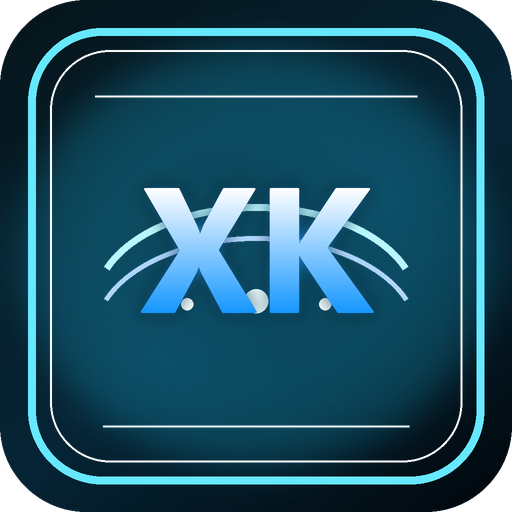

# XK Radio



XK Radio（小K电台）是一款 Windows 桌面沉浸式音乐播放器，集成搜索播放、账号歌单、歌词舞台、桌面歌词、粒子视觉、壁纸窗口和 3D 歌单架。

本项目是基于开源项目 Mineradio 的二次开发版本，继续遵循 GPL-3.0 协议。XK Radio 使用新的应用名称、图标、安装包名称、安装目录和 GitHub 更新源，不再使用原作者 Release 下载入口。

## 下载

正式安装包发布在你的仓库：

[XK Radio Releases](https://github.com/xk271521-droid/XK-Radio/releases)

安装包命名规则：

```text
XKRadio-版本号-Setup.exe
```

免安装本地验证目录：

```text
dist/win-unpacked/XKRadio.exe
```

## 功能

- 网易云音乐搜索、登录、歌单、歌词、播客等体验接入。
- QQ 音乐搜索、登录态、歌单、歌词和音源补充接入。
- 天气电台、每日推荐、私人电台、继续听和我的歌单入口。
- 歌词舞台、桌面歌词、壁纸窗口、粒子视觉和 3D 歌单架。
- 本地音乐导入、自定义封面、自定义歌词、节奏分析缓存。
- GitHub Releases 自动更新检测、安装包下载和轻量补丁逻辑。

## 开发

```powershell
npm install
npm start
```

常用命令：

```powershell
node --check server.js
node --check desktop\main.js
npm run build:win:dir
npm run build:win
```

Windows 打包如果下载 Electron 慢，可以临时使用镜像：

```powershell
$env:ELECTRON_MIRROR='https://npmmirror.com/mirrors/electron/'
$env:NPM_CONFIG_ELECTRON_MIRROR='https://npmmirror.com/mirrors/electron/'
$env:ELECTRON_BUILDER_BINARIES_MIRROR='https://npmmirror.com/mirrors/electron-builder-binaries/'
npm run build:win:dir
```

## 更新机制

XK Radio 会请求 GitHub Releases latest 检测新版本。当前更新源配置为：

```text
owner: xk271521-droid
repo: XK-Radio
```

配置位置在 `package.json` 的 `build.publish` 和 `mineradio.update`。后者沿用原项目的配置键名，目的是减少更新逻辑改动，不代表应用仍使用原品牌。

## 第三方音乐平台说明

XK Radio 不是网易云音乐、QQ 音乐、酷狗音乐、Spotify、Apple Music 或腾讯音乐娱乐集团的官方客户端，也不隶属于任何音乐平台。

项目中的第三方平台接入仅用于用户自有账号的本地客户端体验。请遵守对应平台的用户协议、版权规则和会员权益规则。项目不提供绕过付费、绕过会员、破解音质、批量下载版权音乐或重新分发音乐内容的能力。

## 用户数据与隐私

登录 Cookie、搜索历史、播放历史、自定义封面、自定义歌词、视觉用户存档和节奏分析缓存只应保存在本机。不要把用户账号信息、Cookie、Token、上传音乐或本地缓存提交到 GitHub。

更多说明见 [PRIVACY.md](./PRIVACY.md)。

## 版权与授权

XK Radio 基于 Mineradio 修改而来，保留原项目 GPL-3.0 授权与原作者署名。XK Radio 名称、图标和新增品牌资产属于 xk271521-droid 的二次开发品牌资产。

原 Mineradio 名称、MR Logo、原始视觉表达与相关产品设计归原作者所有。详见 [NOTICE.md](./NOTICE.md) 和 [LICENSE](./LICENSE)。
